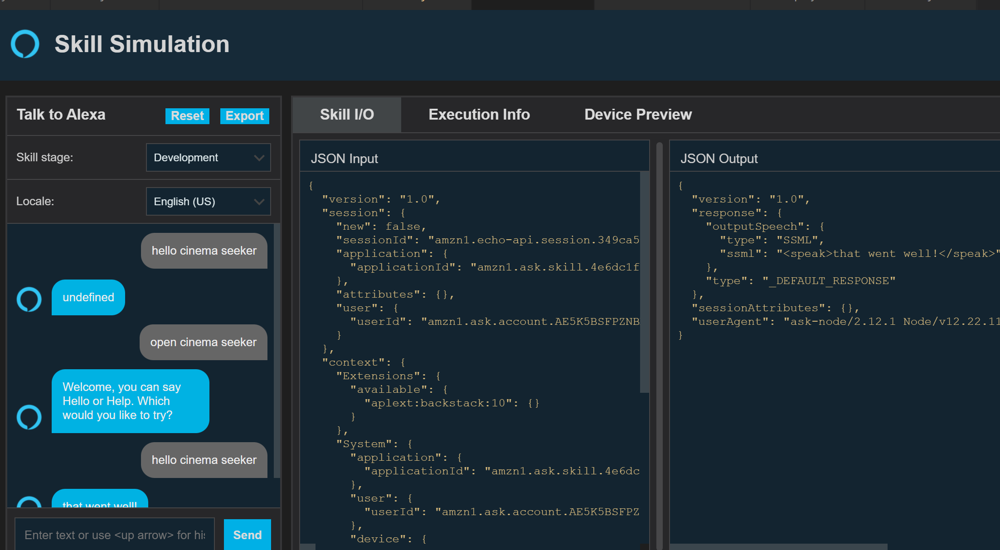
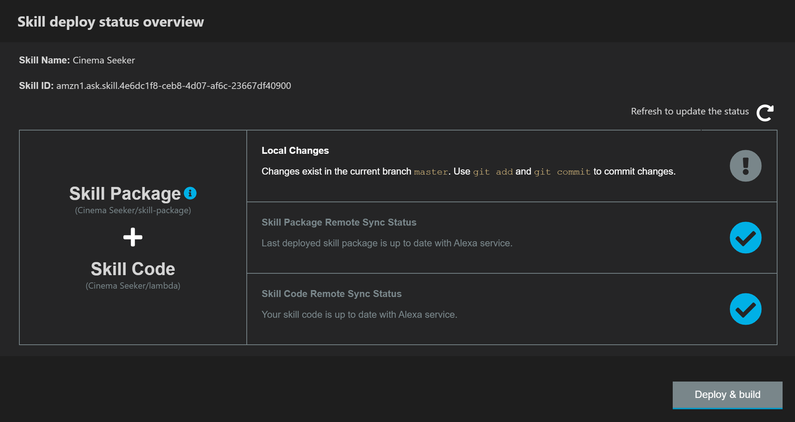
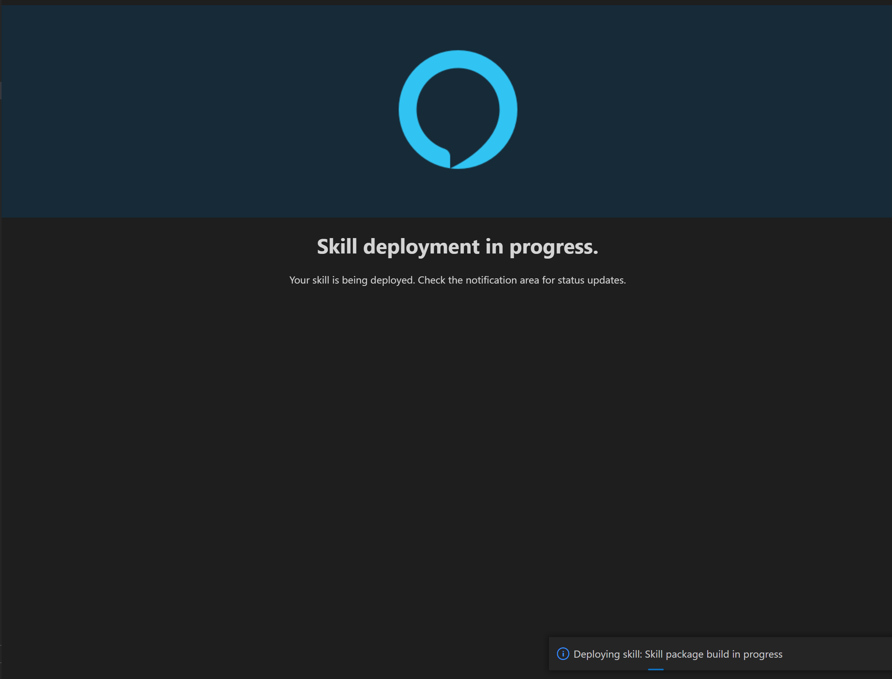
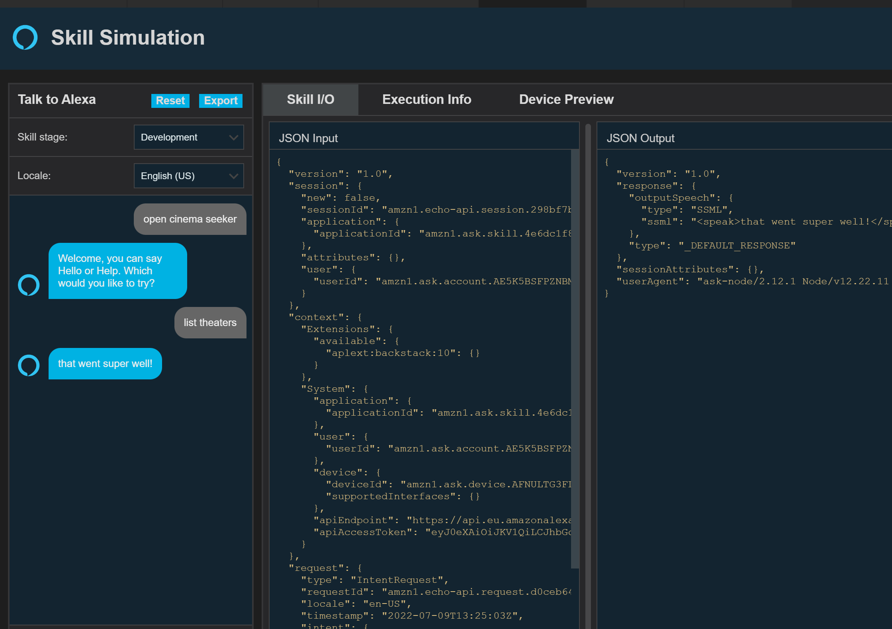

# Alexa Skill

[Developer console](https://developer.amazon.com/alexa/console/ask)


## Developing the skill

> [Develop your first skill blog post](https://developer.amazon.com/en-US/blogs/alexa/alexa-skills-kit/2020/10/code-first-alexa-skill-development-with-vs-code-and-the-ask-sdk-controls-framework.html) on Amazon site

After installing the extension for VSCode and logging in to the Alexa Skill portal, we create a custom skill from the extension menu.

If the extension does not show all the elements listed in the tutorial restarting VS code might help.

### First steps

After following the tutorial and having tested a successful activation request/response, we can move forward to try and implement something.



> N.B. if there are inconsistency between the invocation handle written in the file definition and the one you use in the test view
> double check in the developer console that the invocation handle is correct and the model is built.

### First customizations

#### Identifying the places to change

Now that we have tested the activation intent and the HelloWorldIntent, it's time to start doing some changes.

As we can see looking at the file `en-US.json` that contains the list of intents and utterances that can be used by our skill, we have an `HelloWorldIntent` defined.

```json
{
  "name": "HelloWorldIntent",
  "slots": [],
  "samples": [
    "hello",
    "how are you",
    "say hi world",
    "say hi",
    "hi",
    "say hello world",
    "say hello"
  ]
}
```

The content included in the samples attribute the list of utterances that identify the intent.

The behavior of this intent is implemented in the file `index.js`. The object that handles the intent is called `HelloWorldIntentHandler`.

```javascript
const HelloWorldIntentHandler = {
    canHandle(handlerInput) {
        return Alexa.getRequestType(handlerInput.requestEnvelope) === 'IntentRequest'
            && Alexa.getIntentName(handlerInput.requestEnvelope) === 'HelloWorldIntent';
    },
    handle(handlerInput) {
        const speakOutput = 'that went super well!';

        return handlerInput.responseBuilder
            .speak(speakOutput)
            //.reprompt('add a reprompt if you want to keep the session open for the user to respond')
            .getResponse();
    }
};
```

The method _canHandle_ is used to recognize the intent, while the method _handle_ performs the expected action.

#### Renaming the intent

The purpose of the skill is to provide a list of movies in the nearby theaters, so we are going to name our intent in a more appropriate way.

Let's call it `ListTheatersIntent`.

So we modify the files identified before and see what happens. Below the highlights of the changes

**en-US.json**
```json
{
  "name": "ListTheatersIntent",
  "slots": [],
  "samples": [
    "list theaters",
    "which theaters",
    "what theaters"
  ]
}
```

**index.js**

**Intent definition**
```javascript
const ListTheatersIntentHandler = {
    canHandle(handlerInput) {
        return Alexa.getRequestType(handlerInput.requestEnvelope) === 'IntentRequest'
            && Alexa.getIntentName(handlerInput.requestEnvelope) === 'ListTheatersIntent';
    },
    handle(handlerInput) {
        // ... Removed code for readability
    }
};
```

> We leveraged the refactoring capabilities of the IDE to automaticallt update also the usages. The only other usage is the _registration_ of the handlers

**Intent registration**

```javascript
exports.handler = Alexa.SkillBuilders.custom()
    .addRequestHandlers(
        // ... Removed code for readability
        ListTheatersIntentHandler,
        // ...    
    )
    .addErrorHandlers(ErrorHandler)
    .withCustomUserAgent('sample/hello-world/v1.2')
    .lambda();
```

Time to deploy our changes.

#### Deploy the application

In the Skill extension the _deploy dashboard_ will show that we have some pending changes.



We commit our changes and push the update to the remote repository.





#### Test the changes

Now we should be able to receive the answer `That went super well!` after opening the skill and asking `list theaters`.



The test was successful, and now it's time to start refining the skill. 