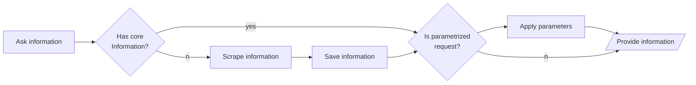

# Content time

Now that we have a basic skeleton for our skill, it's time to take care of the content.

To reduce the number of requests sent to the cinemas website and make our skill effective we will need to save some
information, and the following diagram describe the logic to apply.



Raw content will be obtained by [scraping](#scraping) the relevant websites, and it will be stored
in [DynamoDB](https://developer.amazon.com/en-US/docs/alexa/hosted-skills/alexa-hosted-skills-session-persistence.html).

## Scraping

We need some code to get the information needed from the theater page. For this purpose we are going to use:

* [axios](https://github.com/axios/axios): perform HTTP requests to get content from internet
* [cheerio](https://cheerio.js.org/): parse DOM and provide accessor to elements.

We will start from the [theater](https://www.grupbalana.com/cine/sales/arenas-de-barcelona-multicines/) closest to me.

### Cinema Balaña

With the help of the Developer Tools we open the page to be scraped, and we look for the proper sections that contains
the data.

We find the following:

* `ul.tabs-link li` contains the days that can be selected to show the schedule
    * From this link we extract the name of the section and the date
* the element `.date-row` contained inside the html for the ids extracted before contains information about the movie
    * `h4` contains the title in the format of _**title (doubled) - screening room**_
    * `ul li` contains the screening times

With this information we can build our results.

The results of our scraped content is defined as

```typescript
export type ScrapingResult = {
    days: string[];
    movies: { [title: string]: KnownDubbingType[] };
    screenings: {
        day: string;
        movies: Array<ParsedMovie & { room: string; showTimes: string[] }>;
    }[];
};
```

## Storage

To persist data in our DynamoDB instance we need to install the dependency: `ask-sdk-dynamodb-persistence-adapter`

```shell
npm install ask-sdk-dynamodb-persistence-adapter
```

Once we have added the dependency, we can perform 

* Retrieval:

  ```typescript
  const persistedAttributes =
  (await handlerInput.attributesManager.getPersistentAttributes()) || {};
  ```
* Storage
  ```typescript
  persistedAttributes["savedMovies"] = newValue;
  attributesManager.setPersistentAttributes(persistedAttributes);
  await attributesManager.savePersistentAttributes();
  ```