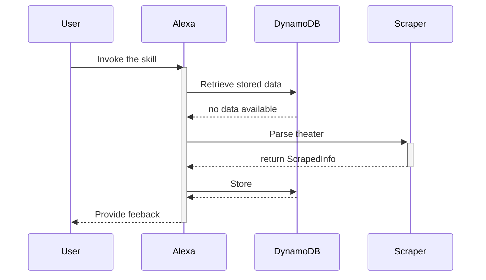
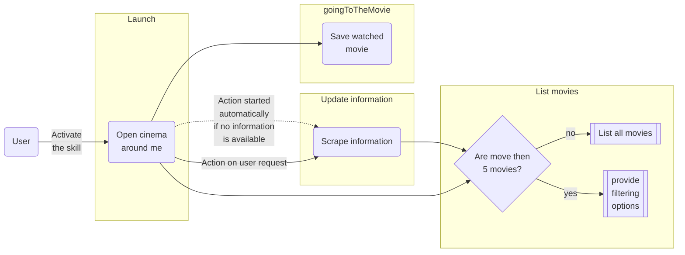

# Interactions

With the ability of writing and reading information persistently, it's time to review the sequence of an interaction
with the skill at the first invocation.

The above sequence occurs all within the single _Launch_ intent.

The current state of intents and their link is far too naive to be an effective interaction model, so it's time to draft a new version.

