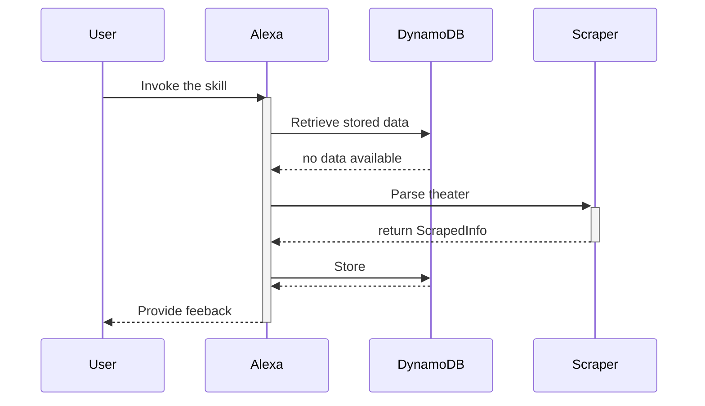
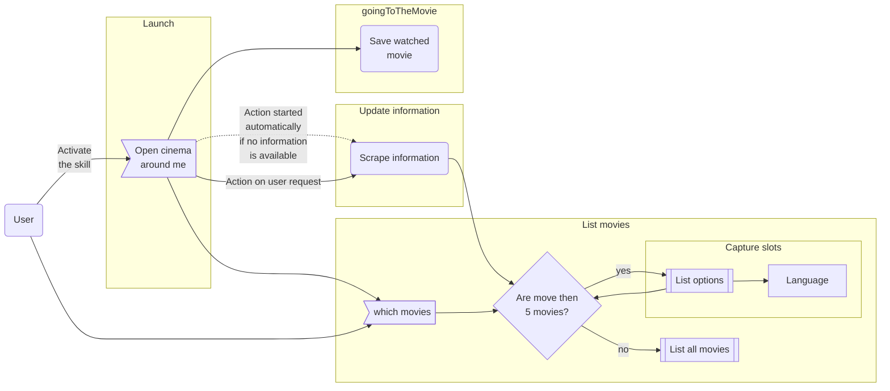

# Interactions

With the ability of writing and reading information persistently, it's time to review the sequence of an interaction
with the skill at the first invocation.

The above sequence occurs all within the single _Launch_ intent.

The current state of intents and their link is far too naive to be an effective interaction model, so it's time to draft a new version.

## Splitting intent

~~Now that we have a working system that initialize at first launch and saves the first information we can realize that the first time it executes, it needs an uncomfortable amount of time to provide feedback.
It seems considerate to provide an early feedback and delegate the scraping and saving to a separate intention.~~

~~Time to take a look at [chaning intentions](https://developer.amazon.com/en-US/blogs/alexa/alexa-skills-kit/2019/03/intent-chaining-for-alexa-skill)~~

The simplest solution is to leave the skill session open configuring the responseBuilder with the method `responseBuilder.withShouldEndSession(false)`. This way Alexa will expect some more utterances before closing the session.