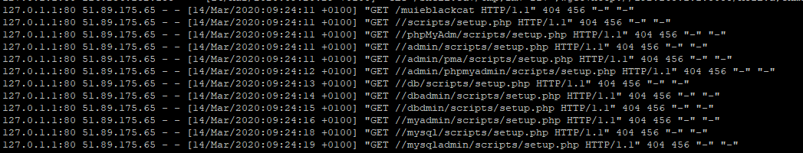

## Security Adventure.

### Apache, MySql and PhpMyAdmin

To play with software and tech I often use resources that I have at home. 

I'm running an headless server with Ubuntu 16 that I use to run the services I need for the tests I want to do. (I know, it's old without LTS, but I still didn't have the time to migrate to a newer version)

Recently a friend of mine asked what would be a simple tool to set up a website. Based on my experience I suggested WordPress, because it is a consolidated product, widely used and with a huge repository of addons/plugins and posts from the community to explain how to do things and I already know how to set it up.

So to help him play with it I set up a WP instance on my local machine and exposed it through Apache.
In addition to the WP instance I also enabled publicly a phpmyadmin application from which changes could be applied to the WP database without my involvement.

With these simple tools installed I left the stack unsupervised for some time until I had some free time.

Taking a look at the logs I noticed some weird requests happening on my webserver 

There were weird requests that were involving also PhpMyAdmin. So I decided to take a look at the database.

To my surprise I couldn't log in anymore and the wordpress instance I had setup for my friend wasn't responding anymore.

After restoring the access to the DB what I realized that the DB wasn't containing any of the schema's I had created, but in their place I had a new schema called `PLEASE_REAME_VVV` containing a single table `warning`.

Querying the table I found a ransom-ware request. Somebody exported my schemas dropped them and left a payment request for 0.05BTC to be performed within 10 days to give the data back or the DB would have been made public or whatever they were thinking could hurt me.

Luckily it was a DEV database containing 0 important data, the only lost thing was my friend's experiment.

But this gave me the chance to think better about securing my webserver, hence after a quick search I found some interesting results:

#### IP Blacklist
* [Tutorial on how to secure Apache with an IP Blacklist](https://confluence.jaytaala.com/display/TKB/Securing+Apache+and+blocking+a+list+of+ip+addresses)
* [IP Blacklist source](https://www.wizcrafts.net/chinese-blocklist_2_4.html#my-cat)

Adapting the information found in the two links above I ended up having a new file in my apache configuration to list a bunch of IP that are worth to be blacklisted and I updated my virtualhost to deny access to those.

#### Apache mod_evasive

Another possible security measure could be to enable some protection against DoS and DDoS and for this the `mod_evasive` module come to help as mentioned in this [nice tutorial](https://www.digitalocean.com/community/tutorials/how-to-protect-against-dos-and-ddos-with-mod_evasive-for-apache-on-centos-7) 

Now I should receive email notification every time something _funny_ is happening on my server.